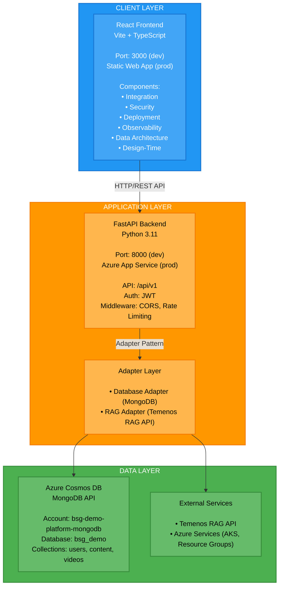
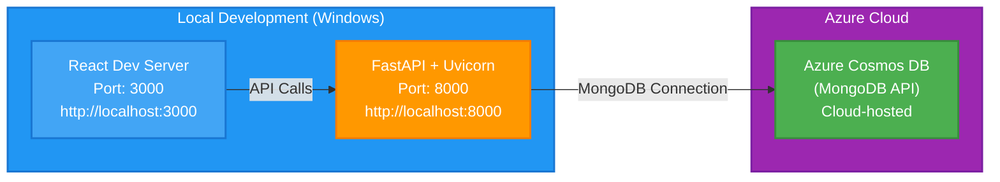
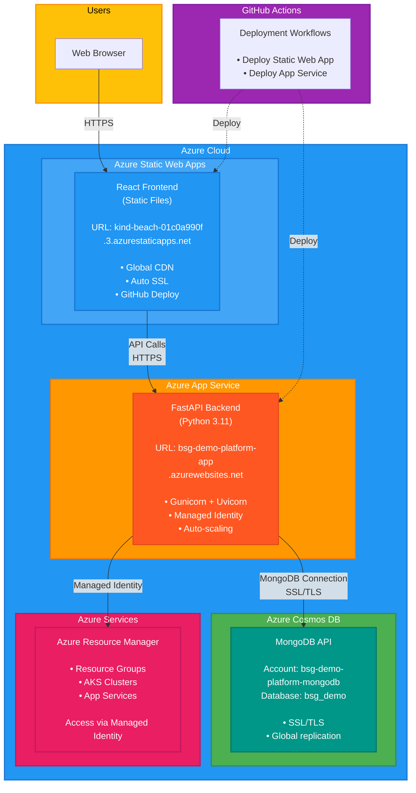

# BSG Demo Platform - Architecture Documentation

## Overview

The BSG Demo Platform is a full-stack web application designed to demonstrate Temenos products and capabilities. It consists of a React frontend, FastAPI backend, and Azure Cosmos DB (MongoDB API) for data storage.

## System Architecture

### High-Level Architecture



## Component Architecture

### Frontend Architecture

**Technology Stack:**
- **Framework**: React 18+ with TypeScript
- **Build Tool**: Vite
- **Styling**: Tailwind CSS
- **HTTP Client**: Axios
- **State Management**: React Context API
- **Routing**: Component-based navigation

**Component Structure:**
```
frontend/src/
├── components/
│   ├── integration/          # Integration & APIs component
│   ├── data-architecture/    # Data Architecture component
│   ├── deployment/           # Deployment & Cloud component
│   ├── security/             # Security component
│   ├── observability/        # Observability component
│   └── design-time/          # Design Time component
├── pages/
│   ├── HomePage.tsx          # Main landing page
│   └── ComponentPage.tsx     # Component detail page
├── services/
│   └── api.ts                # API service layer
└── types/
    └── index.ts              # TypeScript type definitions
```

**Key Frontend Patterns:**
- Component-based architecture with isolated component modules
- Service layer for API communication
- Type-safe API calls with TypeScript
- Responsive design with Tailwind CSS
- Client-side routing for SPA behavior

### Backend Architecture

**Technology Stack:**
- **Framework**: FastAPI (Python 3.11)
- **ASGI Server**: Uvicorn
- **Database**: Motor (async MongoDB driver)
- **Authentication**: JWT (python-jose)
- **Validation**: Pydantic v2
- **Logging**: Structured JSON logging

**Backend Structure:**
```
backend/app/
├── api/                      # API route handlers
│   ├── auth.py              # Authentication endpoints
│   ├── components.py        # Component management
│   ├── deployment.py         # Azure deployment analysis
│   ├── chatbot.py            # RAG chatbot integration
│   └── ...
├── services/                 # Business logic layer
│   ├── temenos_service.py    # Temenos component identification
│   ├── azure_service.py      # Azure resource management
│   ├── aks_service.py        # Kubernetes namespace discovery
│   └── ...
├── adapters/                 # External service adapters
│   ├── database/             # Database adapters
│   │   ├── base.py          # Database adapter interface
│   │   ├── mongodb_adapter.py # MongoDB implementation
│   │   └── factory.py       # Adapter factory
│   └── rag/                  # RAG API adapters
│       ├── base.py          # RAG adapter interface
│       ├── temenos_adapter.py # Temenos RAG implementation
│       └── factory.py       # Adapter factory
├── models/                   # Pydantic data models
├── middleware/               # Request/response middleware
│   ├── auth_middleware.py   # JWT authentication
│   ├── rate_limiter.py      # Rate limiting
│   └── request_middleware.py # Request logging
└── core/                     # Core configuration
    ├── config.py            # Application settings
    ├── database.py           # Database connection management
    └── logging.py            # Logging configuration
```

## Adapter Pattern

### Database Adapter Pattern

**Purpose**: Decouple application logic from database implementation, enabling easy database switching.

**Implementation:**
- All database operations go through `DatabaseAdapter` interface
- Factory pattern selects adapter based on configuration
- Current implementation: `MongoDBAdapter` using Motor
- Future implementations: PostgreSQL, MySQL, etc.

**Usage:**
```python
from app.adapters.database import get_database_adapter

# Get adapter instance
db_adapter = get_database_adapter()

# Use adapter methods
database = await db_adapter.get_database()
collection = database["users"]
```

**Benefits:**
- Easy to switch databases without changing business logic
- Consistent interface across different database types
- Testable with mock adapters

### RAG Adapter Pattern

**Purpose**: Decouple RAG API calls from business logic, enabling multiple RAG providers.

**Implementation:**
- All RAG queries go through `RAGAdapter` interface
- Factory pattern selects adapter based on configuration
- Current implementation: `TemenosAdapter` for Temenos RAG API
- Future implementations: OpenAI, Anthropic, etc.

**Usage:**
```python
from app.adapters.rag import get_rag_adapter

# Get adapter instance
rag_adapter = get_rag_adapter()

# Query RAG API
result = await rag_adapter.query(
    question="What is Temenos Transact?",
    region="global",
    rag_model_id="ModularBanking"
)
```

## Data Model

### MongoDB Collections

**Core Collections:**
- `users` - User accounts and authentication
- `user_sessions` - Active user sessions
- `components` - Component definitions
- `content` - Component content (slides, documents)
- `videos` - Video metadata and references
- `security_docs` - Security documentation
- `presentations` - Presentation materials
- `data_architecture` - Data Architecture component data

**Component-Based Data Organization:**
- Each component has a unique `component_id`
- Component-specific content stored with matching `component_id`
- Collections can be component-specific (e.g., `data_architecture`)
- Shared collections use `component_id` field for filtering

## API Design

### RESTful API Structure

**Base URL:**
- Development: `http://localhost:8000/api/v1`
- Production: `https://bsg-demo-platform-app.azurewebsites.net/api/v1`

**API Versioning:**
- URL-based versioning: `/api/v1/*`
- Current version: v1

**Component API Pattern:**
```
GET  /api/v1/components/{component-id}/content
POST /api/v1/components/{component-id}/content
GET  /api/v1/components/{component-id}/videos
GET  /api/v1/components/{component-id}/demo
POST /api/v1/components/{component-id}/chatbot/query
```

**Common Endpoints:**
- `GET /api/v1/health` - System health status
- `GET /api/v1/ready` - Kubernetes readiness probe
- `GET /api/v1/live` - Kubernetes liveness probe
- `GET /api/v1/components` - List all components

### Authentication

**JWT-Based Authentication:**
- Access tokens: 30 minutes expiration
- Refresh tokens: 7 days expiration
- Token format: `Authorization: Bearer <jwt-token>`
- Role-based access control (RBAC)

## Deployment Architecture

### Development Environment



**Local Setup:**
- Frontend: React dev server on port 3000
- Backend: FastAPI with Uvicorn on port 8000
- Database: Azure Cosmos DB (cloud-hosted)
- No containers: Native processes

### Production Environment



**Azure Deployment:**

- **Frontend**: Azure Static Web Apps
  - URL: `https://kind-beach-01c0a990f.3.azurestaticapps.net`
  - Build: Vite production build
  - Deployment: GitHub Actions
  - Features: Global CDN, automatic SSL, fast content delivery

- **Backend**: Azure App Service (Linux)
  - URL: `https://bsg-demo-platform-app.azurewebsites.net`
  - Runtime: Python 3.11
  - Server: Gunicorn with Uvicorn workers
  - Deployment: GitHub Actions
  - **Authentication**: System-Assigned Managed Identity
  - **Permissions**: Reader role at subscription level (required for Azure resource access)

- **Database**: Azure Cosmos DB (MongoDB API)
  - Account: `bsg-demo-platform-mongodb`
  - Connection: SSL/TLS encrypted
  - Resource Group: `bsg-demo-platform`

**Azure Authentication Configuration:**
- **Managed Identity**: Enabled on App Service
- **Role Assignment**: Reader role at subscription level
- **Scope**: `/subscriptions/<subscription-id>`
- **Purpose**: Allows backend to query Azure resources (resource groups, App Services, Storage Accounts, etc.)

**Known Limitations:**
- **AKS Namespace Discovery**: Currently requires `kubectl` which is not available in Azure App Service
  - Works in local development (kubectl installed)
  - Does not work in Azure App Service (kubectl not installed)
  - Future fix: Use Kubernetes Python client library instead of kubectl

## Security Architecture

### Authentication & Authorization
- JWT-based stateless authentication
- Password hashing with bcrypt
- Role-based access control (RBAC)
- Session management via refresh tokens

### API Security
- CORS configuration for allowed origins
- Rate limiting on all endpoints
- Input validation with Pydantic
- SQL/NoSQL injection prevention
- Security headers middleware

### Data Security
- Encrypted database connections (SSL/TLS)
- Environment variable secrets management
- No secrets in code or configuration files
- HTTPS enforcement in production

## Observability

### Logging
- Structured JSON logging
- Correlation IDs for request tracing
- Log levels: DEBUG, INFO, WARNING, ERROR
- Request/response logging middleware

### Health Monitoring
- Health check endpoints (`/health`, `/ready`, `/live`)
- Database connection health checks
- External service availability checks
- Kubernetes-compatible probes

### Metrics (Future)
- Prometheus-compatible metrics
- OpenTelemetry distributed tracing
- Performance monitoring

## Key Design Principles

### Component Independence
- Each component operates independently
- No direct inter-component dependencies
- Shared infrastructure through common services
- Component-specific data collections

### Adapter Pattern (Mandatory)
- **All external connections MUST use adapters**
- Never connect directly to databases or APIs
- Factory pattern for adapter selection
- Enables easy implementation switching

### API Design
- RESTful API structure
- Consistent response format
- Comprehensive error handling
- OpenAPI documentation

### Scalability
- Async/await throughout backend
- Connection pooling for database
- Stateless API design
- Horizontal scaling ready

## Technology Versions

- **Python**: 3.11+
- **Node.js**: 20+
- **React**: 18+
- **FastAPI**: 0.109+
- **MongoDB**: 4.2.0 compatible (Azure Cosmos DB)
- **TypeScript**: 5.x

## Additional Resources

For more information, see:
- [Azure Services Explained](./AZURE_SERVICES_EXPLAINED.md) - Detailed explanation of Static Web Apps vs App Service
- [Azure Configuration Guide](./AZURE_CONFIGURATION.md) - Step-by-step Azure setup instructions
- [Usage Guide](./USAGE.md) - How to use the platform
- [Troubleshooting Guide](./TROUBLESHOOTING.md) - Common issues and solutions

---

**Last Updated**: November 2025  
**Maintained By**: BSG Team
