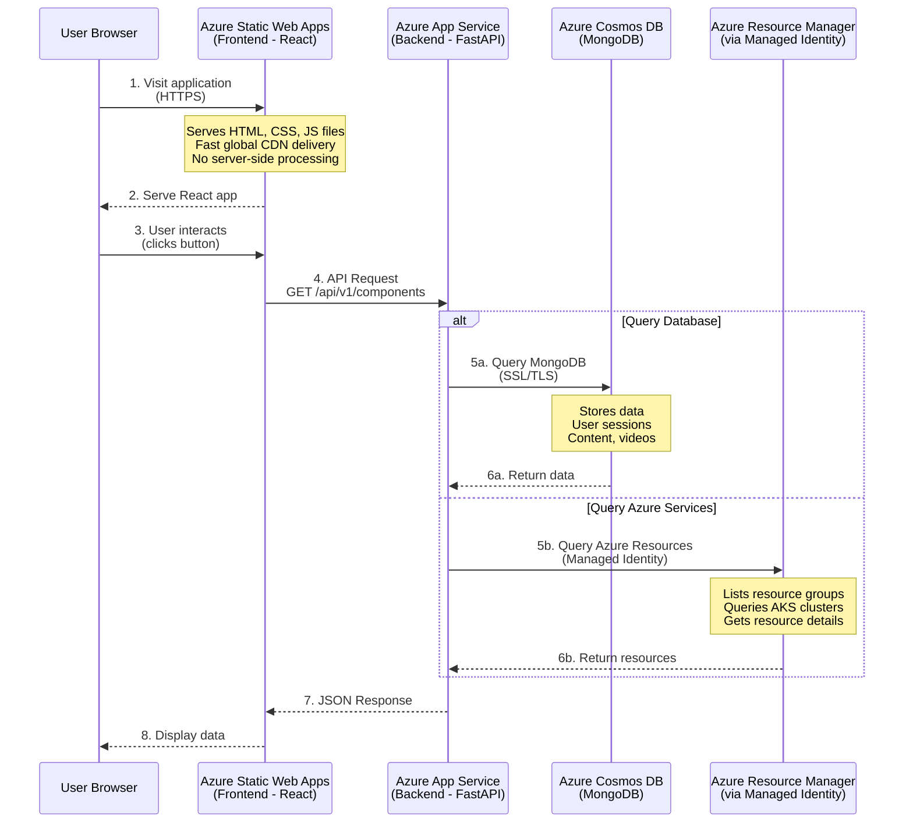

# Azure Services Explained

This document explains the Azure services used in the BSG Demo Platform and why we use them.

## Table of Contents

1. [Azure Static Web Apps](#azure-static-web-apps)
2. [Azure App Service](#azure-app-service)
3. [Why Use Both?](#why-use-both)
4. [Comparison Table](#comparison-table)
5. [Architecture Flow](#architecture-flow)

## Azure Static Web Apps

### What It Is

**Azure Static Web Apps** is a hosting service specifically designed for **static web applications** (frontend applications built with React, Vue, Angular, etc.).

### Key Features

- ✅ **Static File Hosting**: Serves HTML, CSS, and JavaScript files
- ✅ **Global CDN**: Automatically distributes content worldwide for fast loading
- ✅ **Automatic SSL**: Free SSL certificates for HTTPS
- ✅ **GitHub Integration**: Automatic deployment from GitHub repositories
- ✅ **Free Tier Available**: Generous free tier for small applications
- ✅ **Custom Domains**: Support for custom domain names

### What It Does NOT Support

- ❌ **Server-Side Code**: Cannot run Python, Node.js, or any backend code
- ❌ **Database Connections**: Cannot connect to databases directly
- ❌ **API Endpoints**: Cannot host API endpoints (unless using Azure Functions)
- ❌ **Server-Side Rendering**: Cannot render pages on the server
- ❌ **Environment Variables**: Limited support (only build-time variables)

### Best For

- Frontend applications (React, Vue, Angular, Svelte)
- Static websites (HTML/CSS/JavaScript)
- Single Page Applications (SPAs)
- JAMstack applications
- Documentation sites

### In This Project

**Purpose**: Hosts the React frontend application

**URL**: `https://kind-beach-01c0a990f.3.azurestaticapps.net`

**What It Does**:
- Serves the built React application (HTML, CSS, JavaScript files)
- Provides fast, global content delivery via CDN
- Handles HTTPS automatically
- Deploys automatically from GitHub on every push to `develop` branch

**What It Does NOT Do**:
- Cannot run Python/FastAPI backend
- Cannot connect to MongoDB
- Cannot execute server-side logic
- Cannot handle API requests (frontend makes API calls to App Service instead)

---

## Azure App Service

### What It Is

**Azure App Service** is a fully managed platform for hosting **web applications** that need to run server-side code, connect to databases, and handle API requests.

### Key Features

- ✅ **Multiple Languages**: Supports Python, Node.js, .NET, Java, PHP, Ruby, etc.
- ✅ **Server-Side Code**: Can execute any server-side code
- ✅ **Database Connections**: Can connect to databases (MongoDB, PostgreSQL, SQL Server, etc.)
- ✅ **API Endpoints**: Can host REST APIs and web services
- ✅ **Environment Variables**: Full support for runtime environment variables
- ✅ **Managed Identity**: Can authenticate to other Azure services without credentials
- ✅ **Scaling**: Automatic or manual scaling based on demand
- ✅ **Deployment**: Multiple deployment methods (Git, GitHub, FTP, etc.)
- ✅ **Custom Startup Commands**: Can run custom scripts on startup

### What It Supports

- ✅ **Server-Side Execution**: Runs Python, Node.js, .NET, etc.
- ✅ **Database Access**: Connects to Azure Cosmos DB, SQL Database, etc.
- ✅ **API Hosting**: Hosts REST APIs and web services
- ✅ **Background Jobs**: Can run scheduled tasks and background workers
- ✅ **File System Access**: Can read/write files (with limitations)
- ✅ **External Commands**: Can run system commands (with limitations)

### Best For

- Backend APIs (FastAPI, Express, ASP.NET, etc.)
- Web applications with server-side logic
- Applications that need database connections
- Applications that need to authenticate to Azure services
- Applications that need to run continuously

### In This Project

**Purpose**: Hosts the FastAPI backend application

**URL**: `https://bsg-demo-platform-app.azurewebsites.net`

**What It Does**:
- Runs the Python FastAPI application
- Handles all `/api/v1/*` API endpoints
- Connects to Azure Cosmos DB (MongoDB)
- Uses Managed Identity to authenticate to Azure services
- Can query Azure resources (resource groups, App Services, AKS clusters, etc.)
- Handles authentication, authorization, and business logic

**What It Does NOT Do**:
- Does not serve static frontend files (that's Static Web Apps' job)
- Does not have `kubectl` installed by default (needed for AKS namespace discovery)
- Does not have Azure CLI installed by default

---

## Why Use Both?

### The Problem

Our application is a **full-stack application** with:
- **Frontend**: React application (static files)
- **Backend**: FastAPI application (server-side code)

### Why Not Just One?

#### Option 1: Only Static Web Apps?
❌ **Cannot work** - Static Web Apps cannot run Python/FastAPI backend code

#### Option 2: Only App Service?
⚠️ **Could work, but inefficient**:
- More expensive (paying for server resources to serve static files)
- Slower for static assets (no global CDN)
- Less efficient (using server CPU/memory for static content)
- Not following best practices (mixing static and dynamic content)

#### Option 3: Both (Current Setup) ✅
✅ **Optimal solution**:
- Static files served from CDN (fast, cheap, global)
- Backend runs on App Service (can execute code, connect to databases)
- Best performance and cost efficiency
- Follows Azure best practices

---

## Comparison Table

| Feature | Azure Static Web Apps | Azure App Service |
|---------|----------------------|-------------------|
| **Purpose** | Static frontend hosting | Backend/API hosting |
| **Supports** | HTML, CSS, JavaScript | Python, Node.js, .NET, Java, PHP, etc. |
| **Server-Side Code** | ❌ No | ✅ Yes |
| **Database Connections** | ❌ No | ✅ Yes |
| **API Endpoints** | ❌ No (unless Functions) | ✅ Yes |
| **Global CDN** | ✅ Automatic | ❌ No (can add CDN separately) |
| **SSL Certificate** | ✅ Automatic (free) | ✅ Automatic (free) |
| **Scaling** | ✅ Automatic CDN | ⚙️ Manual/Auto-scaling |
| **Cost** | 💰 Free tier available | 💰 Pay-as-you-go |
| **Deployment** | ✅ GitHub Actions | ✅ GitHub Actions, Git, FTP |
| **Environment Variables** | ⚠️ Build-time only | ✅ Runtime variables |
| **Custom Commands** | ❌ No | ✅ Yes (startup scripts) |
| **Managed Identity** | ❌ No | ✅ Yes |
| **File System** | ✅ Read-only | ✅ Read/Write (with limits) |

---

## Architecture Flow

### How Requests Flow Through the System

### Example: User Views Components

1. **User opens browser** → Visits `https://kind-beach-...azurestaticapps.net`
2. **Static Web Apps serves** → React application (HTML, CSS, JS files)
3. **React app loads** → Makes API call: `GET /api/v1/components`
4. **Request goes to App Service** → `https://bsg-demo-platform-app.azurewebsites.net/api/v1/components`
5. **FastAPI processes request** → Queries MongoDB for components
6. **MongoDB returns data** → FastAPI formats and returns JSON
7. **Frontend receives data** → React displays components to user

### Example: User Analyzes Azure Resources

1. **User clicks "Connect to Azure"** → Frontend sends: `POST /api/v1/deployment/azure/connect`
2. **App Service receives request** → FastAPI uses Managed Identity to authenticate
3. **FastAPI queries Azure** → Lists resource groups via Azure Resource Manager API
4. **Azure returns resources** → FastAPI processes and returns to frontend
5. **Frontend displays** → User sees list of resource groups

---

## Deployment Process

### Frontend Deployment (Static Web Apps)

1. **Push to GitHub** → Code pushed to `develop` branch
2. **GitHub Actions triggers** → `deploy-static-webapp.yml` workflow runs
3. **Build frontend** → `npm run build` creates production bundle
4. **Deploy to Static Web Apps** → Files uploaded to Azure CDN
5. **Global distribution** → Content available worldwide in seconds

### Backend Deployment (App Service)

1. **Push to GitHub** → Code pushed to `develop` branch
2. **GitHub Actions triggers** → `deploy-app-service.yml` workflow runs
3. **Build frontend** → Copy frontend build to backend static directory
4. **Install dependencies** → `pip install -r requirements.txt`
5. **Deploy to App Service** → Code uploaded to Azure
6. **App Service starts** → Runs `startup.sh` script
7. **Gunicorn starts** → FastAPI application is live

---

## Cost Considerations

### Static Web Apps
- **Free Tier**: 100 GB bandwidth/month, 100 custom domains
- **Standard Tier**: Pay for additional bandwidth and features
- **Very Cost-Effective**: Static files are cheap to serve

### App Service
- **Free Tier**: Limited (not suitable for production)
- **Basic Tier**: ~$13/month (1 instance, no auto-scaling)
- **Standard Tier**: ~$50/month (auto-scaling, staging slots)
- **Premium Tier**: Higher performance and features

### Our Setup
- **Static Web Apps**: Free tier (sufficient for frontend)
- **App Service**: Standard tier (for production reliability)
- **Total**: ~$50-100/month depending on usage

---

## Key Takeaways

1. **Static Web Apps** = Frontend hosting (React, Vue, Angular)
2. **App Service** = Backend hosting (FastAPI, Express, ASP.NET)
3. **Use both** for optimal performance and cost efficiency
4. **Static files** served from CDN (fast, cheap)
5. **Backend code** runs on App Service (can execute, connect to databases)
6. **This is a standard pattern** for full-stack applications on Azure

---

**Last Updated**: November 2025  
**Maintained By**: BSG Team

